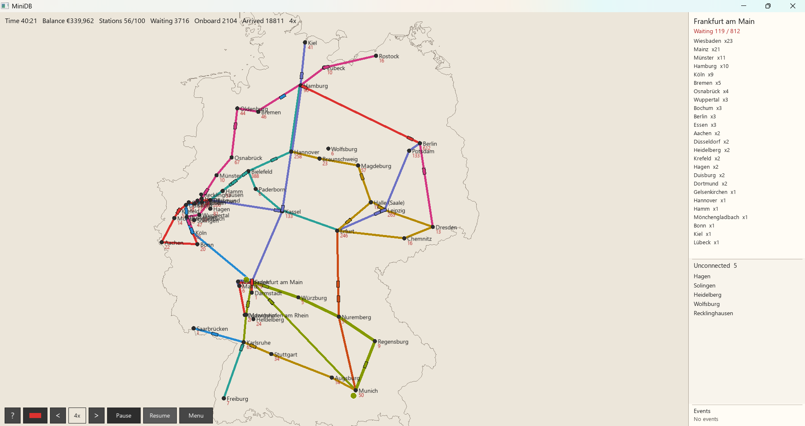

# MiniDB

**Build Germany’s railway network in real time.**

**Version 1.0.0** · 30.08.2026 · [ViezTrinker](https://github.com/ViezTrinker) · [Repository](https://github.com/ViezTrinker/MiniDB)



Cities appear on a schematic map of Germany at their real coordinates. You draw lines, buy trains, and keep passengers moving — while track costs, maintenance, and platform patience try to ruin your day.

Inspired by the spirit of *Mini Metro*, but grounded in German geography and a gravity-based demand model: Berlin pulls more trips than a 12,000-person town.

See [CHANGELOG.md](CHANGELOG.md) for release notes.

---

## Features

- **Real German cities** — places with 10,000+ inhabitants, matched to nearby stations (GeoNames-derived catalog)
- **Live trains & passengers** — shuttles run in simulation time; passengers pick routes with expected waits and transfers
- **Gravity destinations** — large cities attract more traffic; optional destination “events” spike demand
- **Economic mode** — pay for track and trains, earn fares, manage maintenance (Sandbox available for free play)
- **Lose conditions** — bankruptcy after sustained negative balance, or platforms that wait too long (patience)
- **Play session logs** — JSONL dumps next to the executable for balance tuning

Deep dives live under [`doc/`](doc/README.md).

## Requirements

| | |
| --- | --- |
| CMake | 3.24+ |
| Compiler | C++20 (MSVC recommended on Windows) |
| Other | Git; network on first configure (SFML, GoogleTest, nlohmann/json are fetched automatically) |

## Build & run

```bash
cmake -S . -B build
cmake --build build --config Release
```

Run tests:

```bash
ctest --test-dir build -C Release --output-on-failure
```

| Generator | Executable |
| --- | --- |
| Multi-config (Visual Studio) | `build/bin/Release/MiniDB.exe` |
| Single-config (Ninja, etc.) | `build/bin/MiniDB` / `MiniDB.exe` |

`data/` is copied next to the binary. Start the game, open **Settings**, then **Start**.

## How to play

1. Cities unlock over time (faster in Sandbox).
2. Click stations to draft a line → **Enter** / right-click to confirm (first train is included).
3. Extend lines with terminus handles, insert stations by dragging a line onto a city, drop the train token to add capacity.
4. Keep cash non-negative and platforms from overflowing — or enable **Never lose** / **Sandbox** in Settings.

**Escape** returns to the menu without wiping the run (**Resume** continues it).

### Controls (short)

| Input | Action |
| --- | --- |
| Left-click station | Inspect / draft |
| Enter / right-click | Confirm line |
| Drag terminus / line | Extend / insert station |
| Train token → line | Add a train |
| Del | Delete selected line |
| Ctrl+Z / Ctrl+Y | Undo / redo draft |
| Space | Pause |
| `1` `2` `4` `8` / bottom bar | Speed (up to 16×) |
| Wheel / `+` `-` | Zoom |
| Arrows / middle-drag | Pan |
| F11 | Fullscreen |
| `?` | In-game help |

## Economy (default)

Unless **Sandbox** is on:

- Starting balance scales with train capacity (**€500,000** at capacity 160).
- Unique track pairs cost to build; shared segments are free after the first build.
- New lines must afford **track + first train**.
- Trains have purchase and per-second maintenance costs; passengers pay fare by beeline distance.
- Cities unlock every **45 sim seconds** in economic mode (every **5 s** in Sandbox); spawn pressure rises with unlocks.
- Crowded platforms add dwell time.

### Game over

| Condition | Rule |
| --- | --- |
| Bankruptcy | Balance stays negative for **5 minutes of real time** (pause freezes the timer) |
| Platform patience | After **20 sim minutes** of grace: **360 s** wait on a connected platform, or **900 s** if the station is still unconnected |

**Never lose** keeps economy numbers running but disables both lose conditions.

Economic sessions write `logs/play_YYYYMMDD_HHMMSS.jsonl` beside the executable.

## Tech

- **C++20** simulation core (`MiniDbCore`) + SFML 3 UI
- Headless-friendly world APIs and GoogleTest coverage
- Station catalog + Germany outline as static JSON/GeoJSON ([`data/DATA_SOURCES.md`](data/DATA_SOURCES.md))

Regenerate station data (optional):

```bash
python tools/generate_station_data.py
```

## Not in this build

- Regional vs long-distance train classes or fares
- Multiple stations per city
- Real railway geometry / timetable speeds
- Spectator AI (experimental work lives on other branches)

## License & data

No project license file is published in this repository yet — clarify that before redistributing binaries.

Station and outline data attributions are listed in [`data/DATA_SOURCES.md`](data/DATA_SOURCES.md) (GeoNames CC BY 4.0, Germany outline via isellsoap/deutschlandGeoJSON / BKG-derived data).
